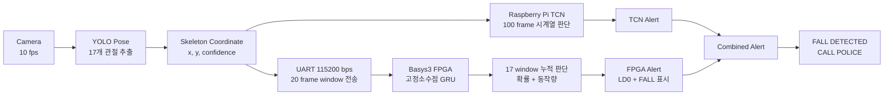

# Fall-Less

### Skeleton 기반 TCN 소프트웨어와 FPGA GRU 하드웨어를 결합한 고령자 낙상 감지 시스템

[최종 발표 자료](docs/final_presentation.pdf) | [시연 영상](assets/fall_less_demo.mp4) | [전체 과제 보고서](docs/PROJECT_REPORT.md)

## 1. 프로젝트 개요

Fall-Less는 고령자의 실내 낙상을 조기에 감지하고 보호자 또는 관리자에게 알림을 전달하기 위한 엣지형 안전 시스템이다.

욕실은 물기와 미끄러운 바닥 때문에 낙상 가능성이 높지만, 카메라에 대한 사생활 거부감도 큰 공간이다. 일반 홈 카메라는 원본 영상을 직접 처리하거나 저장할 수 있고, 레이더 방식은 반사체가 많은 실내 환경에서 멀티패스와 오탐 문제를 가질 수 있다.

본 프로젝트는 원본 영상 대신 사람의 관절 위치를 나타내는 **skeleton coordinate**를 핵심 데이터로 사용한다. Raspberry Pi는 영상에서 관절 좌표를 추출하고 TCN으로 1차 판단한다. 동시에 좌표 시퀀스를 UART로 FPGA에 보내며, FPGA는 고정소수점 GRU를 실행해 독립적으로 2차 판단한다.

> 외부 하드웨어로 전달되는 정보는 원본 영상이 아니라 관절 좌표뿐이다. 기본 설정에서는 원본 영상을 저장하지 않으며, 알림용 스냅샷과 Telegram 전송도 비활성화되어 있다.

## 2. 최종 시스템



## 3. 소프트웨어와 하드웨어의 역할

| 구분 | Raspberry Pi 소프트웨어 | Basys3 FPGA 하드웨어 |
|---|---|---|
| 입력 | 카메라 영상 | UART skeleton packet |
| 전처리 | YOLO Pose, 좌표 정규화 | packet parsing, fixed-point 변환 |
| 시계열 모델 | TCN | GRU |
| 판단 단위 | 100 frame | 20 frame window × 17 |
| 출력 | 화면 상태, TCN alert | UART result, LD0, 7-segment `FALL` |
| 독립성 | FPGA와 별도로 판단 | Raspberry Pi TCN과 별도로 판단 |

두 판단기가 모두 낙상을 확인하면 Raspberry Pi 화면에 `FALL DETECTED / CALL POLICE` 경고창을 표시한다.

## 4. 핵심 알고리즘

### Raspberry Pi TCN

- 입력: `100 × 51`
- 51개 feature: 17개 관절의 `x, y, confidence`
- TCN channel: `[64, 128, 128]`
- dilation: `1, 2, 4`
- 낙상 확률 threshold: `0.70`
- 2회 연속 확인 후 TCN alert 확정
- 체크포인트 기록 성능: F1 `0.9712`, recall `0.9441`

### FPGA 고정소수점 GRU

- 입력 window: `20 × 51`
- hidden size: `64`
- 좌표 입력: signed 18-bit
- weight/hidden: 16-bit
- sigmoid/tanh: LUT
- 한 번의 곱셈기를 시간 분할해 사용하여 자원 사용량 절감
- 100 frame 동안 stride 5로 17개 window 처리

현재 실기 시연용 FPGA 판정 조건:

1. 17개 window 중 2개 이상이 확률 `0.70` 이상
2. 17개 window의 평균 확률이 `0.50` 이상
3. 유효 관절의 평균 동작량이 `0.07` 이상

기존 데이터셋 최적화 프로필은 `0.65 / 1개 / 0.45 / 0.06` 조건으로
115/118을 기록했다. 현재 중간형 프로필은 실시간 YOLO Pose 좌표가 한두 frame
불안정해졌을 때 발생하는 단발성 경보는 막으면서, 보수형 설정보다 실제 낙상
감지력을 높이기 위해 적용했다.

## 5. 검증 결과

### GRU record-level 평가

| 항목 | 결과 |
|---|---:|
| 전체 record | 118 |
| 정답 | 115 |
| 정확도 | **97.46%** |
| TP / TN / FP / FN | **75 / 40 / 0 / 3** |
| Fall recall | **96.15%** |
| No-fall specificity | **100.00%** |

위 표는 118개 record에 직접 최적화한 민감형 프로필의 결과다. 현재 보드에
적용된 중간형 프로필의 동일 데이터셋 참고 결과는 104/118,
`TP/TN/FP/FN = 64/40/0/14`이다.

### FPGA 구현

| 항목 | Basys3 구현 결과 |
|---|---:|
| FPGA | Xilinx Artix-7 `xc7a35tcpg236-1` |
| Clock | 100 MHz |
| WNS | **+0.127 ns** |
| LUT | 4,347 / 20,800, 20.90% |
| FF | 4,210 / 41,600, 10.12% |
| BRAM | 17.5 / 50, 35.00% |
| DSP | 7 / 90, 7.78% |
| Bitstream | 생성 및 Basys3 실기 프로그래밍 완료 |

자세한 내용은 [검증 보고서](docs/VALIDATION.md)를 참고한다.

## 6. UART 연결

| Raspberry Pi 5 | Basys3 | 방향 |
|---|---|---|
| GPIO14, pin 8, TXD | JA1, FPGA RX | Pi → FPGA |
| GPIO15, pin 10, RXD | JA2, FPGA TX | FPGA → Pi |
| GND, pin 6 | JA GND | 공통 GND |

- 115200 baud
- 8 data bits
- no parity
- 1 stop bit
- flow control 없음
- 전원선은 연결하지 않음

상세 packet 구조는 [UART 프로토콜](docs/UART_PROTOCOL.md)에 정리되어 있다.

## 7. 저장소 구조

```text
.
├── software/raspberry_pi/       Raspberry Pi TCN 및 UART 통합 코드
├── hardware/fpga_gru/           GRU RTL, testbench, bitstream, Vivado report
├── data/                        skeleton coordinate 평가 데이터
├── results/                     정확도 및 parameter 결과
├── docs/                        기술 보고서와 발표 자료
└── assets/                      시연 영상
```

## 8. 실행 순서

1. Basys3에 [중간형 bitstream](hardware/fpga_gru/bitstream/GRU_Fall_Detect_MODERATE_FINAL.bit)을 program한다.
2. Raspberry Pi와 Basys3의 TX, RX, GND를 연결한다.
3. YOLO Pose와 TCN model file을 `software/raspberry_pi/models/`에 배치한다.
4. [환경설정 예시](software/raspberry_pi/.env.example)를 참고해 실행 환경을 설정한다.
5. Raspberry Pi user service를 시작한다.

자세한 설치 절차는 [실행 가이드](docs/SETUP_AND_RUN.md)를 참고한다.

## 9. 시연 동작

1. 카메라가 사람을 검출한다.
2. skeleton과 상태 정보가 VNC 화면에 표시된다.
3. TCN buffer와 GRU window가 각각 채워진다.
4. FPGA가 낙상을 확정하면 LD0가 켜지고 7-segment에 `FALL`이 표시된다.
5. Raspberry Pi는 FPGA UART 응답을 수신한다.
6. TCN과 FPGA가 모두 낙상을 확정하면 긴급 경고창이 표시된다.

시연 영상: [assets/fall_less_demo.mp4](assets/fall_less_demo.mp4)

## 10. 프로젝트의 의미

Fall-Less는 단일 AI 모델의 정확도만을 제시하는 프로젝트가 아니다. 영상 처리, 시계열 소프트웨어 모델, UART 통신, 고정소수점 신경망 RTL, FPGA 실기 검증을 하나의 동작 가능한 시스템으로 연결했다.

향후에는 FPGA prototype을 기반으로 GRU 추론부와 통신부를 SoC 또는 ASIC으로 통합하고, 실제 주거 환경 데이터로 일반화 성능을 추가 검증할 수 있다.
