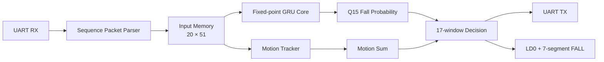

# FPGA GRU 하드웨어

## 처리 흐름



## 주요 RTL

| 파일 | 기능 |
|---|---|
| `gru_sequence_uart_parser.sv` | 입력 packet 해석과 checksum 검사 |
| `gru_fixed_core.sv` | 고정소수점 GRU 계산 |
| `gru_motion_tracker.sv` | 유효 관절의 frame 간 동작량 계산 |
| `gru_chunk_decision.sv` | 17개 window 결과 누적 |
| `gru_result_uart_tx.sv` | 확률과 class 응답 |
| `gru_fall_detector_top.sv` | 전체 module 연결 |
| `seven_segment_fall_display.v` | `FALL` 표시 |

## 수치 표현

- 입력 좌표: Q6에 해당하는 signed 18-bit
- GRU weight: signed 16-bit
- hidden state: signed 16-bit
- 출력 확률: unsigned Q15
- sigmoid/tanh: lookup table

floating point, division, arctan IP는 사용하지 않는다.

## 판정 parameter

현재 실기 시연에는 민감형과 보수형 사이의 중간형 프로필을 사용한다.
단일 관절 오인식은 차단하되 실제 낙상을 지나치게 놓치지 않도록 조정했다.

| Parameter | 값 |
|---|---:|
| `WINDOWS_PER_CHUNK` | 17 |
| `HIGH_THRESHOLD_Q15` | 22938, 약 0.70 |
| `MIN_HIGH_WINDOWS` | 2 |
| `AVG_SUM_THRESHOLD_Q15` | 278528, 평균 0.50 |
| `MOTION_THRESHOLD_Q14` | 1147, 약 0.07 |

기존 데이터셋 최적화 프로필은 각각 `0.65`, `1개`, `0.45`, `0.06`을
사용해 115/118을 기록했다. 중간형 프로필은 한 번의 높은 확률만으로는
확정하지 않으면서 보수형보다 낙상 감지 조건을 낮춘 설정이다.

## 출력 유지와 reset

낙상 확정 후 `fall_alert`는 latch된다. Basys3의 BTNC를 누르면 active-high reset이 입력되어 LED와 7-segment 표시가 초기화된다.

## 빌드

Vivado 2020.2 Tcl console:

```tcl
source hardware/fpga_gru/scripts/build_bitstream.tcl
```

최종 bitstream:

```text
hardware/fpga_gru/bitstream/GRU_Fall_Detect_MODERATE_FINAL.bit
```
